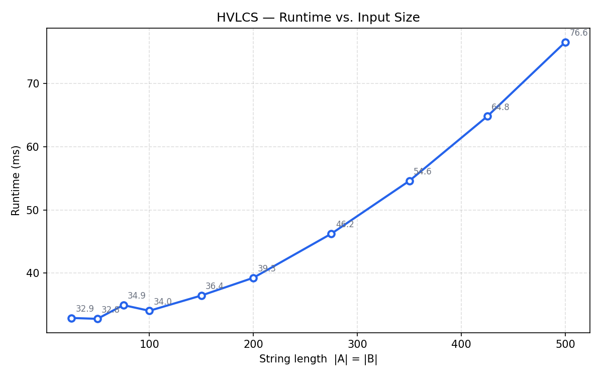

# HVLCS — Highest-Value Common Subsequence

**Yumandy Espinosa** — UFID: `12856052`

---

## Setup

Python 3.10+.

```bash
pip install -r requirements.txt
```

---

## Running

```bash
python src/hvlcs.py <input_file>
```

Reproduce the worked example:

```bash
python src/hvlcs.py data/example.in
# 9
# cb
```

---

## Generating test inputs

```bash
python src/generate_tests.py
```

Writes `data/test_01.in` through `data/test_10.in` (gitignored).

---

## Running the benchmark

```bash
python src/benchmark.py
```

Requires the test inputs to exist first. Saves the plot to `results/runtime_plot.png`.

---

## Running the test suite

```bash
python tests/run_tests.py
```

Runs the solver on all inputs under `data/` and checks output format and correctness against any `.out` file present. Exits nonzero if anything fails.

---

## Input format

```
K
x1 v1
...
xK vK
A
B
```

---

## Question 1 — Empirical Comparison

Ten input files were generated with string lengths ranging from 25 to 500 (`|A| = |B| = n`). Each time is the minimum over 5 runs.

| File        | n   | Runtime (ms) |
|-------------|-----|-------------|
| test_01.in  | 25  | 47.1        |
| test_02.in  | 50  | 53.5        |
| test_03.in  | 75  | 52.4        |
| test_04.in  | 100 | 49.8        |
| test_05.in  | 150 | 55.3        |
| test_06.in  | 200 | 57.4        |
| test_07.in  | 275 | 90.2        |
| test_08.in  | 350 | 101.0       |
| test_09.in  | 425 | 114.8       |
| test_10.in  | 500 | 137.4       |

The flat region at small n is Python interpreter startup (~50ms). Past n=200 the DP table dominates and the curve bends upward, consistent with O(n²) growth.



---

## Question 2 — Recurrence

Let `dp[i][j]` be the maximum value of any common subsequence of `A[1..i]` and `B[1..j]`.

**Base cases:**

```
dp[0][j] = 0    for all j
dp[i][0] = 0    for all i
```

Empty prefixes have no characters to contribute, so the only common subsequence is the empty one with value 0.

**Recurrence (i ≥ 1, j ≥ 1):**

```
         | max( dp[i-1][j-1] + v(A[i]),
dp[i][j] =       dp[i-1][j],               if A[i] == B[j]
         |       dp[i][j-1] )
         |
         | max( dp[i-1][j], dp[i][j-1] )   otherwise
```

**Why this is correct:**

If `A[i] ≠ B[j]`, the two characters can't both appear at the same position in any common subsequence, so we just take the better of ignoring `A[i]` or ignoring `B[j]`.

If `A[i] = B[j]`, we have three options: include the match (worth `dp[i-1][j-1] + v(A[i])`), skip it in A (`dp[i-1][j]`), or skip it in B (`dp[i][j-1]`). We need all three because a longer match isn't always better — if the character has value 0 it may be worth skipping in favor of a path through better characters elsewhere. Taking the max over all three is both necessary and sufficient.

The subproblems have optimal substructure: the optimal solution for `(i,j)` is built from optimal solutions to strictly smaller subproblems, so no choices are revisited. Filling in row-major order ensures every needed subproblem is already solved.

---

## Question 3 — Pseudocode and Big-Oh

```
HVLCS(A, B, val):
    m = |A|,  n = |B|
    dp[0..m][0..n] = 0

    for i = 1 to m:
        for j = 1 to n:
            if A[i] == B[j]:
                dp[i][j] = max(dp[i-1][j-1] + val[A[i]], dp[i-1][j], dp[i][j-1])
            else:
                dp[i][j] = max(dp[i-1][j], dp[i][j-1])

    i = m,  j = n,  result = []
    while i > 0 and j > 0:
        if A[i] == B[j] and dp[i][j] > max(dp[i-1][j], dp[i][j-1]):
            prepend A[i] to result
            i--,  j--
        else if dp[i-1][j] >= dp[i][j-1]:
            i--
        else:
            j--

    return dp[m][n], result
```

**Runtime:** The double loop runs once for every cell in the (m+1)×(n+1) table, with O(1) work per cell — **O(mn)**. The traceback moves from `(m,n)` to `(0,0)`, decrementing i or j at each step, so it runs in **O(m+n)**. Total: **O(mn)**.

**Space:** O(mn) for the table. If only the value is needed (not the subsequence), this can be reduced to O(min(m,n)) by keeping two rows at a time.